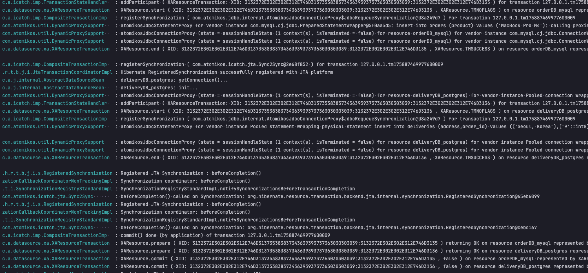

# 분산 트랜잭션 JTA/XA 패턴
## 문제상황

두개의 서로 다른 MySQL, Postgresql DB를 사용하여 주문 정보와 배송 정보를 하나의 프로세스에서 저장되는 상황으로 예제파일을 만들었습니다. 주문이 성공하면 배송 정보도 반드시 생성되어야 하고, 둘중 하나라도 실패하면 모든 작업이 롤백되어야 합니다.

## 주요 설정

1. mysql, postgresql 설정
- **MySQL**: XA 트랜잭션을 실행할 사용자에게 `XA_RECOVER_ADMIN` 권한을 부여해야 합니다.SQL
    
    ```sql
    - 'your_user'@'%' 에게 권한 부여
    GRANT XA_RECOVER_ADMIN ON *.* TO 'your_user'@'%';
    FLUSH PRIVILEGES;
    ```
    
- **PostgreSQL**: `postgresql.conf` 파일에서 `max_prepared_transactions` 값을 0보다 큰 값(예: 100)으로 설정해야 합니다. 이 값을 변경한 후에는 PostgreSQL 서버를 재시작해야 합니다.
    
    ```sql
    # postgresql.conf 파일 수정
    max_prepared_transactions = 100 # 기본값은 0, 트랜잭션 수에 맞게 조절
    ```
    
2. JPA 설정파일 필요
    
    **수동 설정의 우선순위**: 개발자가 `EntityManagerFactory` Bean을 직접 생성하면, Spring Boot는 "개발자가 알아서 하겠지"라고 판단하고 `application.yml`의 JPA 설정을 자동으로 적용해주지 않습니다.
    
    `JpaConfig.java` 생성하여 `application.yml` 설정 주입
    
2. dbconfig 설정(OrderDbConfig, DeliveryDbConfig)
    
    데이터소스에 연결될 `EntityManagerFactory` 와 `PlatformTransactionManager` 를 설정해야 합니다. Spring Boot가 JTA 환경임을 감지하고 `JtaTransactionManager` 를 자동으로 빈으로 등록해주므로, 각 데이터소스에 대한 `EntityManagerFactory` 만 설정하면 됩니다.
    
    설정 핵심
    
    - `@EnableJpaRepositories`: 각 설정 클래스가 스캔할 Repository의 패키지와 사용할 `EntityManagerFactory`를 명시적으로 지정합니다.
    - `AtomikosDataSourceBean`: `application.yml`에 정의한 XA 데이터소스 설정을 읽어 Atomikos가 관리하는 DataSource 빈을 생성합니다.
    - `LocalContainerEntityManagerFactoryBean`: JPA의 `EntityManagerFactory`를 생성합니다. `setJtaDataSource()`를 통해 JTA 트랜잭션에 참여할 데이터소스를 지정하는 것이 중요합니다.
    - `hibernate.transaction.jta.platform`: Hibernate가 JTA 트랜잭션 매니저(여기서는 Atomikos)와 통신할 수 있도록 플랫폼을 지정합니다.
    - `javax.persistence.transactionType`: JPA가 JTA 트랜잭션을 사용하도록 명시합니다.

## 로그확인

TM과 RM이 서로 상호작용하면서 준비, 커밋/롤백을 하고 있는데 상세하게 확인해보겠습니다.

### 성공

RM 주문(mysql), 배송(postgresql)이 정상적으로 성공되었다면 mysql과 postgresql 서버로그에서는 명령어 실행이후 준비(Prepare) 완료 명령어를 TM atomikos에게 보내어 TM은 모든 RM에게 준비가 완료되었다는 받았다면 TM이 commit명령어를 호출하여 RM에게 보냅니다.


_Spring log_


_MySQL log_


_PostgreSQL log_

### 실패

실패 분산 트랜잭션에 롤백 경우에는 주문(mysql)이 성공이후 에러가 발생하였다면 TM은 RM에게 rollback명령어를 보냅니다.


_Spring log_


_MySQL log_